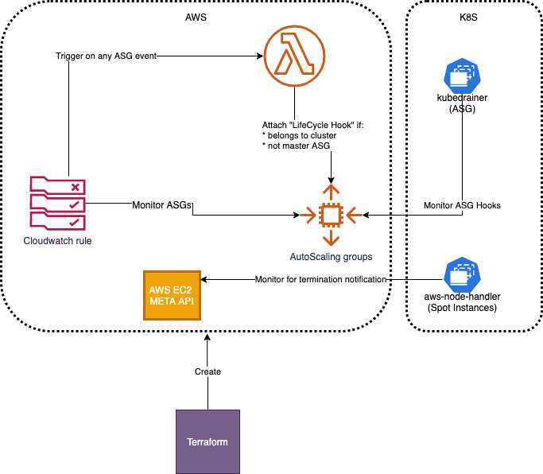

# Readme

A Kubernetes DaemonSet to gracefully handle EC2 Spot Instance interruptions and changes in Autoscaling groups.

## Original source-code

* [Spot instance handling](https://github.com/aws/aws-node-termination-handler)
* [ASG handling](https://github.com/VirtusLab/kubedrainer)

## Architecture

